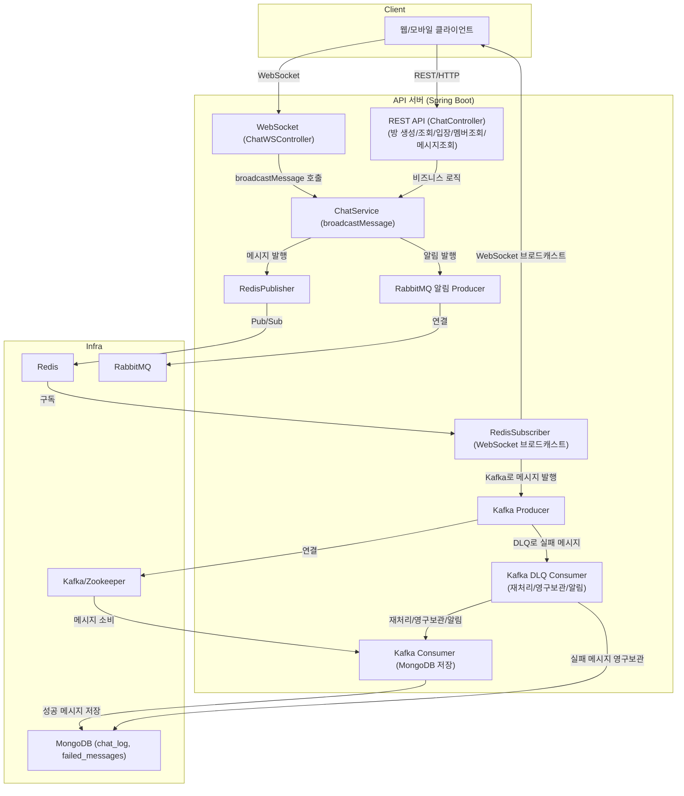

# 전체 시스템 구조 다이어그램

```mermaid
flowchart TD
  subgraph "Client"
    A1["웹/모바일 클라이언트"]
  end

  subgraph "API 서버 (Spring Boot)"
    B2["WebSocket (ChatWSController)"]
    B3["ChatService (broadcastMessage)"]
    B4["RedisPublisher"]
    B5["RedisSubscriber (WebSocket 브로드캐스트)"]
    B6["Kafka Producer"]
    B7["Kafka Consumer (MongoDB 저장)"]
    B8["RabbitMQ 알림 Producer"]
    B9["REST API (ChatController)\n(방 생성/조회/입장/멤버조회/메시지조회)"]
    B10["Kafka DLQ Consumer\n(재처리/영구보관/알림)"]
  end

  subgraph "Infra"
    C1["Redis"]
    C2["Kafka/Zookeeper"]
    C3["MongoDB (chat_log, failed_messages)"]
    C4["RabbitMQ"]
  end

  A1 -- "WebSocket" --> B2
  B2 -- "broadcastMessage 호출" --> B3
  B3 -- "알림 발행" --> B8
  B8 -- "연결" --> C4
  B3 -- "메시지 발행" --> B4
  B4 -- "Pub/Sub" --> C1
  C1 -- "구독" --> B5
  B5 -- "Kafka로 메시지 발행" --> B6
  B5 -- "WebSocket 브로드캐스트" --> A1
  B6 -- "연결" --> C2
  C2 -- "메시지 소비" --> B7
  B7 -- "성공 메시지 저장" --> C3

  %% DLQ 흐름
  B6 -- "DLQ로 실패 메시지" --> B10
  B10 -- "재처리/영구보관/알림" --> B7
  B10 -- "실패 메시지 영구보관" --> C3

  %% REST API는 채팅 메시지 전송과 무관, 관리성 엔드포인트만 담당
  A1 -- "REST/HTTP" --> B9
  B9 -- "비즈니스 로직" --> B3
``` 